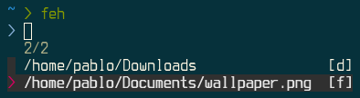
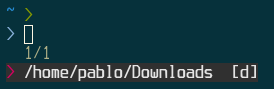

# zfm - Zsh Fuzzy Marks

`zfm` is a command line bookmark manager for Zsh built on top of [fzf](https://github.com/junegunn/fzf).
It lets you bookmark files and directories in your system and rapidly access them.

It's intended to be a less intrusive alternative to `z`, `autojump` or `fasd` that doesn't pollute your prompt command (`PS1`) or create bookmarks behind the scenes: you have full control over what gets bookmarked and when, like bookmarks on a web browser.

# Installation

## Install fzf

`zfm` is built on top of `fzf` so you must install that first. Follow the instructions [here](https://github.com/junegunn/fzf#installation).

## Install zfm

### Oh My Zsh

1. Clone the repo in Oh My Zsh's plugin directory:

```sh
git clone https://github.com/pabloariasal/zfm ${ZSH_CUSTOM:-~/.oh-my-zsh/custom}/plugins/zfm}
```

2. Activate the plugin in your `.zshrc`:

```sh
plugins=(zfm)
```

### Antigen

Add this to your `.zshrc`:

```sh
antigen bundle pabloariasal/zfm
```

### Manual (Git Clone)

1. Clone the repo

```sh
git clone https://github.com/pabloariasal/zfm ~/.zsh/zfm
```

2. Add the following to your `.zshrc`:

```sh
source ~/.zsh/zfm/zfm.zsh
```

# Usage

## Bookmark files and directories

```sh
$ zfm add ~/Downloads ~/Documents/wallpaper.png
```

## List bookmarks

```sh
$ zfm list
/home/pablo/Downloads                [d]
/home/pablo/Documents/wallpaper.png  [f]
```

list only bookmarked files:

```sh
$ zfm list --files
/home/pablo/Documents/wallpaper.png  [f]
```
or directories:

```sh
$ zfm list --dirs
/home/pablo/Downloads  [d]
```

## Enter a bookmark into the current command line buffer

To enter a bookmark into the current command line buffer, press `ctrl+o`.
This will open a selection menu with all your bookmarks:



and enter your selection(s) into the current command line buffer:


## `cd` into a bookmarked directory

Off course you can cd into a bookmarked directory, just press `ctrl+p`.

This will open a selection menu with all your bookmarked directories:



and directly jump to the directory you have selected:


Alternatively, you can type `f` followed by a pattern to directly jump to the directory matching the pattern (like `autojump`):

```sh
$ f down
/home/pablo/Downloads$
```
If the pattern is ambiguous a selection menu will be opened with the possible options.

## Use in custom scripts

You can use `zfm` in scripts and aliases.

### Example: Open a bookmarked file in Vim
For example, you can create an alias to open a bookmarked file with vim by adding this to your `.zshrc`:

```sh
alias of='vim $(zfm select --files --multi)'
```
Typing `of` will open a selection menu with all bookmarked files and directly open the selection in vim.

The option `--multi` allows you to select multiple entries.

### Example: Open a bookmarked file using `dmenu`
You can create a script that opens a bookmarked file in dmenu:

```
#!/usr/bin/env zsh

selection=$(zfm list --files | dmenu | awk '{print $1}')
gvim "$selection"
# or open in vim inside a terminal emulator
alacritty -e vim "$selection"
```

## Edit Bookmarks

You can edit your bookmarks (add, delete, reorder) with:

```sh
zfm edit
```

This will open your bookmarks in a text editor (as defined by `EDITOR`) and let you manually edit, remove or reorder your bookmarks.

# Commands

| Command | Description | Extra Options
| --- | --- | ---
| `zfm list` | List bookmarks | `--files`, `--dirs`
| `zfm add <path> [<path>...]` | Add a bookmark. |
| `zfm select` | Open selection menu with all bookmarks and print selection to stdout. | `--files`, `--dirs`, `--multi`
| `zfm query <pattern>` | Print bookmark matching `pattern` to stdout. Selection menu will open if match is ambiguous. | `--files`, `--dirs`
| `zfm edit` | Open and edit the bookmarks file |
| `zfm fix` | Remove bookmarked entries that no longer exist in the filesystem |
| `zfm clear` | Remove all bookmarks |
| `f <pattern>` | Jump to bookmark directory matching `pattern`, open selection if ambiguous |

# Options

| Option | Description | Available for |
| --- | --- | --- |
| `--files` | Restrict to just files | `query`, `list`, `select` |
| `--dirs` | Restrict to just dirs | `query`, `list`, `select` |
| `--multi` | Allow selecting multiple items | `select` |

# Key Bindings

| Key Binding | Description |
| --- | --- |
| `ctrl+o` | Select one or multiple bookmarks and insert them into the current command line |
| `ctrl+p` | jump to selected directory               |


# Variables

## `ZFM_NO_BINDINGS`

Per default, `zfm` creates two key bindings, `ctrl-p` and `ctrl-o`.
To disable the creation of key bindings, you can set the environment variable `ZFM_NO_BINDINGS` in your `zshrc`:

```shell
export ZFM_NO_BINDINGS=1
```

or if you wish so, you can rebind them to something else, see [F.A.Q](#faq).

## `ZFM_BOOKMARKS_FILE`

Sets the bookmarks file. Defaults to `~/.zfm.txt`

```shell
export ZFM_BOOKMARKS_FILE='~/.my_bookmarks.txt'
```

# F.A.Q

### Why not `autojump`, `z`, `fasd` and others?

Because explicit is better than implicit. I don't want every single directory I visit to be bookmarked, I know which directories I visit the most and which files I need rapid access to.

### I don't like the default key bindings, can I change them?

Sure, you can set the `ZFM_NO_BINDINGS` environment variable to disable keybindings or manually unbind them by putting this on your `zshrc`:

```
bindkey -r '^P'
bindkey -r '^O'
```

You can also rebind them to something more suitable to you:

```
bindkey -r '^P'
bindkey -r '^O'
bindkey '^A' zfm-cd-to-bookmark
bindkey '^E' zfm-insert-bookmark
```
*Tip:* you can use `ctrl+v` on your terminal window to display escape sequences of key bindings.

# Contributing

If you change anything make sure to run the tests, bonus points if you enhance them:
## Running the Tests

**NOTE:** you must have python 3.5 or higher installed

1) Install `pipenv`:
```sh
pip install --user pipenv
```

2) Run the tests
```sh
cd zfm
pipenv run pytest -q test
```
